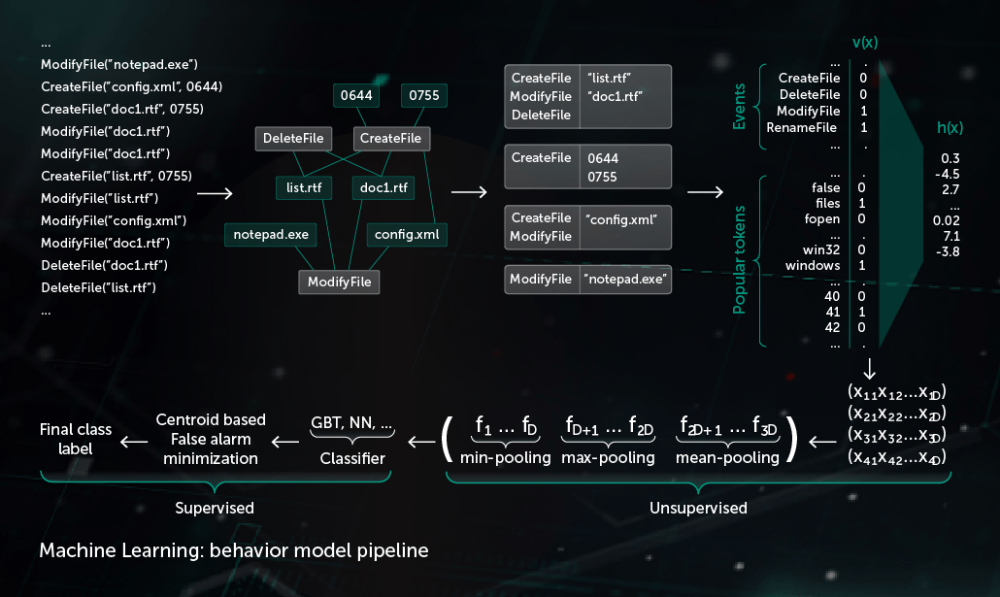

# Awesome-AI-for-cybersecurity
Awesome list of AI for cybersecurity, including network (network traffic analysis and intrusion detection), endpoint (anti-malware), application (WAF or database firewalls), user (UBA), process behavior (anti-fraud).

## 1. Introduction
First, beginners should look at machine learning tasks and its applications. I wrote a [machine learning blog](https://github.com/Billy1900/Awesome-Machine-Learning) including CV (CNN,GAN), RL, GNN, NLP. 

Additionally, developers still need to know more about security/cybersecurity, here is the [awesome list of security tool and knowledge.](security.md)

Then, let's turn to AI for cybersecurity.

The first dimension is a goal or a task. According to Gartner’s PPDR model, all security tasks can be divided into five categories:
- prediction;
- prevention;
- detection;
- response;
- monitoring.

The second dimension is a technical layer and the list of layers for this dimension:
- network (network traffic analysis and intrusion detection);
- endpoint (anti-malware);
- application (WAF or database firewalls);
- user (UBA);
- process behavior (anti-fraud).

## 2. Network Protection
ML in network security implies new solutions called Network Traffic Analytics (NTA) aimed at in-depth analysis of all the traffic at each layer and detect attacks and anomalies.

How can ML help here? There are some examples:
- regression to predict the network packet parameters and compare them with the normal ones;
- classification to identify different classes of network attacks such as scanning and spoofing;
- clustering for forensic analysis.

And here are some research papers:
- [Machine Learning Techniques for Intrusion Detection](https://arxiv.org/abs/1312.2177v2)
- [A survey of network anomaly detection techniques](https://www.gta.ufrj.br/~alvarenga/files/CPE826/Ahmed2016-Survey.pdf)
- [Shallow and Deep Networks Intrusion Detection System: A Taxonomy and Survey](https://arxiv.org/abs/1701.02145v1)
- [A Taxonomy and Survey of Intrusion Detection System Design Techniques, Network Threats and Datasets](https://arxiv.org/pdf/1806.03517v1.pdf)

## 3. Endpoint Protection
If you deal with machine learning at endpoint layer, your solution may differ depending on the type of endpoint (e.g., workstation, server, container, cloud instance, mobile, PLC, IoT device).

Every endpoint has its own specifics but the tasks are common:
- regression to predict the next system call for executable process and compare it with real ones;
- classification to divide programs into such categories as malware, spyware and ransomware;
- clustering for malware protection on secure email gateways (e.g., to separate legal file attachments from outliers).

- [Deep learning at the shallow end: Malware classification for non-domain experts](https://arxiv.org/abs/1807.08265v1)
- [Malware Detection by Eating a Whole EXE](https://arxiv.org/pdf/1710.09435v1.pdf)

## 4. Application Security
There are web applications, databases, ERP systems, SaaS applications, micro services, etc. WAFs or Code analysis, both static and dynamic can be applied to this.

Here are examples what you can do with machine learning for application security:
- regression to detect anomalies in HTTP requests (for example, XXE and SSRF attacks and auth bypass);
- classification to detect known types of attacks like injections (SQLi, XSS, RCE, etc.);
- clustering user activity to detect DDOS attacks and mass exploitation.

paper list:
- [Adaptively Detecting Malicious Queries in Web Attacks](https://arxiv.org/pdf/1701.07774.pdf)

## 5. User Behavior
Unlike malware detection focusing on common attacks and the possibility to train a classifier, user behavior is one of the complex layers and unsupervised learning problem.

Here are the tasks that companies solve with the help of ML:
- regression to detect anomalies in User actions (e.g., login in unusual time);
- classification to group different users for peer-group analysis;
- clustering to separate groups of users and detect outliers.

- [Detecting Anomalous User Behavior Using an Extended Isolation Forest Algorithm: An Enterprise Case Study](https://arxiv.org/abs/1609.06676)

## 6. Process Behavior (fraud detection)
While dealing with process behavior, it’s necessary to know a business process in order to find something anomalous. Business processes can differ significantly. You can look for fraud in banking and retail system, or a plant floor in manufacturing.

In general, there are the examples of tasks in the process area:
- regression to predict the next user action and detect outliers such as credit card fraud;
- classification to detect known types of fraud;
- clustering to compare business processes and detect outliers.

A monitoring component provides a behavior log - the sequence of system events occurred during the process execution together with corresponding arguments. In order to detect malicious activity in observed log data our model compresses obtained sequence of events to a set of binary vectors and trains the deep neural network to distinguish clean and malicious logs.

</img>

- [A Survey of Credit Card Fraud Detection Techniques: Data and Technique Oriented Perspective](https://arxiv.org/abs/1611.06439v1)
- [Anomaly detection; Industrial control systems; convolutional neural networks](https://arxiv.org/abs/1806.08110v1)

## 7. Intrusion Detection and Prevention Systems (IDS/IPS)
These systems detect malicious network activities and prevent intruders from accessing the systems and alerts the user. Typically, they are recognized by known signatures and generic attack forms. This is useful against threats like data breaches.

Traditionally, this task was performed by ML algorithms. However, these algorithms caused the system to generate many false-positive, creating tedious work for security teams and causing unnecessary fatigue.

Deep learning, convolutional neural networks and Recurrent Neural Networks (RNNs) can be applied to create smarter ID/IP systems by analyzing the traffic with better accuracy, reducing the number of false alerts and helping security teams differentiate bad and good network activities.

Notable solutions include Next-Generation Firewall (NGFW),Web Application Firewall (WAF), and User Entity and Behavior Analytics (UEBA).

## 8. Books & survey paper
### 8.1 Book
- [AI for Cybersecurity by Cylance(2017)](https://www.blackberry.com/us/en/forms/cylance/gated-content/introduction-to-ai-book?_ga=2.89683291.1595385041.1538052662-139740503.1538052662)
- [Machine Learning and Security](https://www.oreilly.com/library/view/machine-learning-and/9781491979891/)
- [Mastering Machine Learning for Penetration Testing](https://www.packtpub.com/product/mastering-machine-learning-for-penetration-testing/9781788997409)
- [Malware Data Science](https://nostarch.com/malwaredatascience)
### 8.2 Survey Paper
- [Deep Learning Algorithms for Cybersecurity Applications: A Technological and Status Review](https://www.sciencedirect.com/science/article/pii/S1574013720304172)
- [Machine Learning and Cybersecurity Hype and Reality](https://cset.georgetown.edu/publication/machine-learning-and-cybersecurity/)

