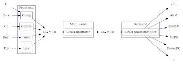

**Everythings is on [llvm official website.](https://llvm.org/)**

## 1. Introduction 
</img>

And the [llvm download page](https://releases.llvm.org/), select a version (3.2) and then download three files:
- LLVM source code
- Clang source code
- Compiler RT source code

下载后进行解压，解压后应该得到三个名字分别为llvm-3.2.src、clang-3.2.src、compiler-rt-3.2.src。这时候，需要对这三个文件夹进行重命名，llvm-3.2.src重命名可以根据自己习惯，此处推荐重命名为llvm-3.2；clang-3.2.src重命名为clang，并且将此文件夹整体放到llvm-3.2/tools下，包含clang这个顶层文件夹；compiler-rt-3.2.src重命名为compiler-rt，并且将包含顶层文件夹的整体文件夹放到llvm-3.2/projects/下.

此时，打开一个终端，切换到llvm-3.2目录下，依次输入如下命令：
```shell
mkdir build
cd build
cmake ../
make
```
然后就可以在llvm-3.2/build/bin目录下看到一大堆的可执行文件. 此处不使用make install是方便在系统上使用多版本的llvm进行研究和修改.

这个时候可以运行如下命令，来看看clang:
```shell
./clang -v
./clang -help
```
可以写一个简单的helloworld程序，使用clang进行编译，使用方法和gcc相同：
```shell
./clang hello.c
./a.out
```

## 2. LLVM Doc
- [llvm documentation](https://llvm.org/docs/)
- [The programmer manual](https://llvm.org/docs/ProgrammersManual.html)

LLVM的文档主要分为一下几类：
- Design & Overview
这个类别里的文档主要是几篇介绍LLVM架构和设计的论文和会议报告。

- Publications
这个类别主要是一个已经发布的基于LLVM的项目列表。

- User Guides
这个类别的文档主要是针对刚接触LLVM，打算使用LLVM的用户，并且此类用户打算接触LLVM的中间表示。如果只是打算把LLVM作为一个编译器使用，可以考虑clang :  http://clang.llvm.org/ 或者DragonEgg:  http://dragonegg.llvm.org/

- API Clients
这个类别主要是针对以LLVM为基础进行工程开发的人。提供一些介绍编程需要的文档。比如:编程手册、编程规范等文档。

- Subsystems
这个类别里的文档主要是介绍子系统的。相对前一个类别，这个列别里的文档都是针对的是LLVM里的某一块。比如介绍如何写Pass,如何写 Backend等。

- Development Process
这个类别里主要介绍的是开发过程中的几个动作需要的文档。如何构建工程，如果编译工程，如何发布等。

- Mailing Lists
这里主要是几个邮件列表，有开发的还有报告bug的，还有关于提交代码的。

## 3. LLVM IR
IR是 intermediate representation的缩写，顾名思义是中间表示的的缩写。中间表示已经被越来越多的编译器所采用，传统的编译器多采用汇编语言作为自己的中间语言，而现在大一些的编译器都有了自己专属的中间表示。LLVM IR的官方文档地址： http://llvm.org/docs/LangRef.html

LLVM IR主要有三种格式：一种是在内存中的编译中间语言；一种是硬盘上存储的二进制中间语言(以.bc结尾)，最后一种是可读的中间格式(以.ll结尾)。这三种中间格式是完全相等的。

LLVM IR是LLVM优化和进行代码生成的关键。根据可读的IR，我们可以知道再最终生成目标代码之前，我们已经生成了什么样的代码。而且根据IR，我们可以选择使用不同的后端而生成不同的可执行代码。同时，因为使用了统一的IR，所以我们可以重用LLVM的优化功能，即使我们使用的是自己设计的编程语言。

如果想直观的看下llvm的IR到底是什么样的，可以先写一个helloworld的程序，文件名字叫做hello.c。

然后根据文档的内容使用下列命令可以得到二进制的.bc文件：
`clang -emit-llvm -c hello.c -o hello.bc`

然后使用下列命令可以得到对应的`hello.ll`文件，这个文件是可读的，可以通过文本编辑器打开。
`llvm-dis hello.bc`

## 4. LLVM Pass
阅读文档 Write an LLVM pass: http://llvm.org/docs/WritingAnLLVMPass.html

LLVM 的Pass框架是LLVM系统的一个很重要的部分。每个Pass都是做优化或者转变的工作，LLVM的优化和转换工作就是由很多个Pass来一起完成的。

所以按照我的理解，Pass就是LLVM系统转化和优化的工作的一个节点，每个节点做一些工作，这些工作加起来就构成了LLVM整个系统的优化和转化。Pass架构这么做的话，可重用性非常好，你可以选择已有的一些Pass，自己去构建出自己想要的优化和转化效果。并且自己也可以重新写Pass去做自己想要的优化和转变，因为每个Pass都可以独立存在，所以新建Pass并不用考虑LLVM之前的优化和转化是怎么做的，自己可以只运行自己新建的Pass，这样可以方便的实现自己想要的效果。

## MISC
- [LLVM coding standards](https://llvm.org/docs/CodingStandards.html)
- [用LLVM开发新语言](https://llvm-tutorial-cn.readthedocs.io/en/latest/index.html)
